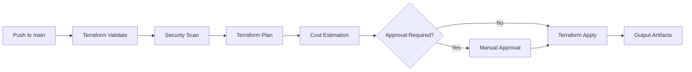
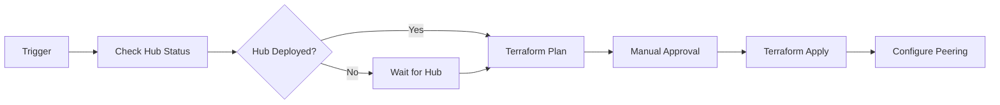

# GitHub Actions Integration - Azure Landing Zone Factory

GitHub Actions-based alternative to Spacelift for deploying Azure Landing Zones.

## Overview

This directory contains GitHub Actions workflows, bootstrapper, and configuration for deploying Azure Landing Zones using GitHub Actions instead of Spacelift.

## Architecture Comparison

| Feature | Spacelift | GitHub Actions |
|---------|-----------|----------------|
| **State Management** | Built-in | Azure Storage Backend |
| **Approval Gates** | Native approval policies | Environment protection rules |
| **Dependencies** | Stack dependencies | Workflow dependencies |
| **Secrets** | Contexts | GitHub Secrets/Environments |
| **Policies** | OPA/Rego | Custom actions + branch protection |
| **Cost** | Per-run pricing | Included in GitHub plan |
| **Private Workers** | Worker pools | Self-hosted runners |

## Directory Structure

```
github-actions/
├── bootstrapper/          # Setup GitHub environments and secrets
│   ├── main.tf           # Terraform for GitHub configuration
│   ├── variables.tf
│   └── README.md
├── workflows/
│   ├── reusable/         # Reusable workflow templates
│   │   ├── terraform-plan.yml
│   │   ├── terraform-apply.yml
│   │   └── terraform-destroy.yml
│   ├── hub/              # Hub deployment workflows
│   │   └── hub-deployment.yml
│   ├── spoke/            # Spoke deployment workflows
│   │   └── spoke-deployment.yml
│   └── factory/          # Factory workflows
│       └── stack-generator.yml
├── actions/              # Composite actions
│   ├── setup-terraform/
│   ├── azure-login/
│   └── cost-estimation/
├── policies/             # GitHub Actions policies
│   ├── branch-protection.tf
│   └── required-reviewers.tf
└── README.md
```

## Quick Start

### 1. Bootstrap GitHub Configuration

```bash
cd github-actions/bootstrapper
terraform init
terraform apply
```

This creates:
- GitHub Environments (production, staging, development)
- Environment secrets for Azure authentication
- Protection rules for production
- Branch protection rules

### 2. Deploy Hub Infrastructure

```bash
# Trigger hub deployment
gh workflow run hub-deployment.yml \
  --ref main \
  -f environment=production \
  -f location=eastus
```

### 3. Deploy Spoke Infrastructure

```bash
# Trigger spoke deployment
gh workflow run spoke-deployment.yml \
  --ref main \
  -f environment=production \
  -f spoke_name=spoke-corp-prod-001 \
  -f hub_name=hub-connectivity-prod
```

## Features

### Environment-Based Deployments

GitHub Environments provide:
- **Secrets scoping**: Different Azure credentials per environment
- **Protection rules**: Required reviewers for production
- **Deployment branches**: Restrict which branches can deploy
- **Deployment history**: Track all deployments

### Reusable Workflows

Standardized workflows for:
- Terraform plan with cost estimation
- Terraform apply with approval gates
- Drift detection
- Destroy operations

### Composite Actions

Custom actions for:
- Azure authentication with OIDC
- Terraform setup with version pinning
- Cost estimation integration
- Security scanning

### State Management

Terraform state stored in Azure Storage:
- Encryption at rest
- Blob versioning enabled
- Soft delete enabled
- Access via managed identity

## Configuration

### Environment Secrets

Each environment requires these secrets:

**Production Environment:**
- `AZURE_CLIENT_ID` - Service principal client ID
- `AZURE_TENANT_ID` - Azure AD tenant ID
- `AZURE_SUBSCRIPTION_ID` - Target subscription ID
- `AZURE_CLIENT_SECRET` - Service principal secret (or use OIDC)

**Optional Secrets:**
- `TERRAFORM_CLOUD_TOKEN` - For Terraform Cloud state
- `COST_ESTIMATION_API_KEY` - For cost estimation
- `SLACK_WEBHOOK_URL` - For notifications

### Workflow Inputs

Hub deployment inputs:
```yaml
inputs:
  environment:
    description: 'Environment (production, staging, development)'
    required: true
  location:
    description: 'Azure region'
    required: true
  address_space:
    description: 'Hub VNet CIDR'
    default: '10.0.0.0/16'
```

Spoke deployment inputs:
```yaml
inputs:
  spoke_name:
    description: 'Spoke stack name'
    required: true
  hub_name:
    description: 'Hub stack name for dependency'
    required: true
  environment:
    required: true
```

## Deployment Workflows

### Hub Deployment Flow



### Spoke Deployment Flow



## Best Practices

### 1. Use OIDC Instead of Service Principal Secrets

```yaml
- name: Azure Login
  uses: azure/login@v1
  with:
    client-id: ${{ secrets.AZURE_CLIENT_ID }}
    tenant-id: ${{ secrets.AZURE_TENANT_ID }}
    subscription-id: ${{ secrets.AZURE_SUBSCRIPTION_ID }}
```

### 2. Pin Action Versions

```yaml
- uses: hashicorp/setup-terraform@v3
  with:
    terraform_version: 1.8.0
```

### 3. Use Environments for Production

```yaml
jobs:
  deploy:
    environment:
      name: production
      url: https://portal.azure.com
```

### 4. Matrix Deployments for Multi-Region

```yaml
strategy:
  matrix:
    region: [eastus, westus2, northeurope]
```

### 5. Cache Terraform Providers

```yaml
- uses: actions/cache@v3
  with:
    path: ~/.terraform.d/plugin-cache
    key: terraform-${{ hashFiles('**/.terraform.lock.hcl') }}
```

## Migration from Spacelift

### Key Differences

1. **State Storage**: Configure Azure Storage backend
2. **Secrets**: Move from Spacelift contexts to GitHub secrets
3. **Dependencies**: Use `needs` in workflows instead of stack dependencies
4. **Policies**: Implement as workflow steps + branch protection

### Migration Steps

1. Export Spacelift stack configurations
2. Create equivalent GitHub workflows
3. Set up GitHub environments
4. Configure Azure Storage for state
5. Test in development environment
6. Migrate production with approval gates

## Troubleshooting

### Authentication Failures

```bash
# Verify Azure credentials
az login --service-principal \
  -u $AZURE_CLIENT_ID \
  -p $AZURE_CLIENT_SECRET \
  --tenant $AZURE_TENANT_ID

# Test permissions
az account show
```

### State Lock Issues

```bash
# Release state lock
terraform force-unlock <LOCK_ID>

# Or via Azure CLI
az storage blob lease break \
  --blob-name terraform.tfstate \
  --container-name tfstate
```

### Workflow Debugging

Enable debug logging:
```yaml
env:
  ACTIONS_RUNNER_DEBUG: true
  ACTIONS_STEP_DEBUG: true
```

## Security Considerations

1. **Never commit secrets** - Use GitHub Secrets or Azure Key Vault
2. **Use OIDC** - Eliminate long-lived credentials
3. **Require reviews** - Enforce protection rules on production
4. **Scan for secrets** - Use secret scanning
5. **Pin dependencies** - Lock action versions with SHA

## Examples

See the `/examples` directory for:
- Complete hub deployment workflow
- Spoke with dependencies
- Multi-region deployment
- GitOps-style deployment
- Disaster recovery workflow

## Support

For issues or questions:
- GitHub Actions: [GitHub Actions Documentation](https://docs.github.com/actions)
- Azure: [Azure Provider Documentation](https://registry.terraform.io/providers/hashicorp/azurerm/latest/docs)

## License

MIT License - see [LICENSE](../LICENSE) for details.
